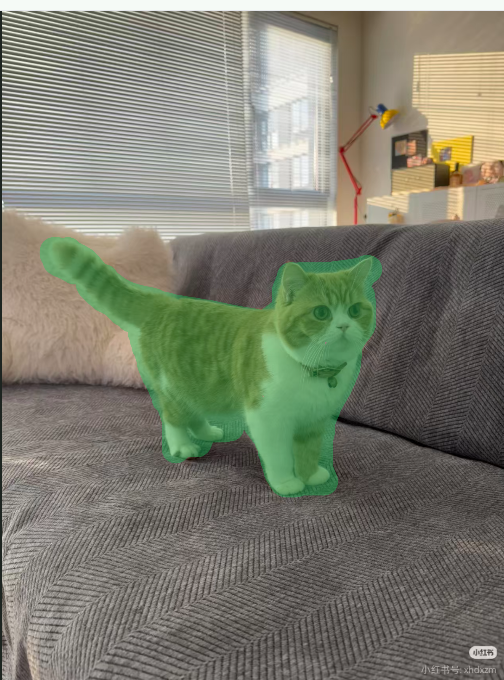
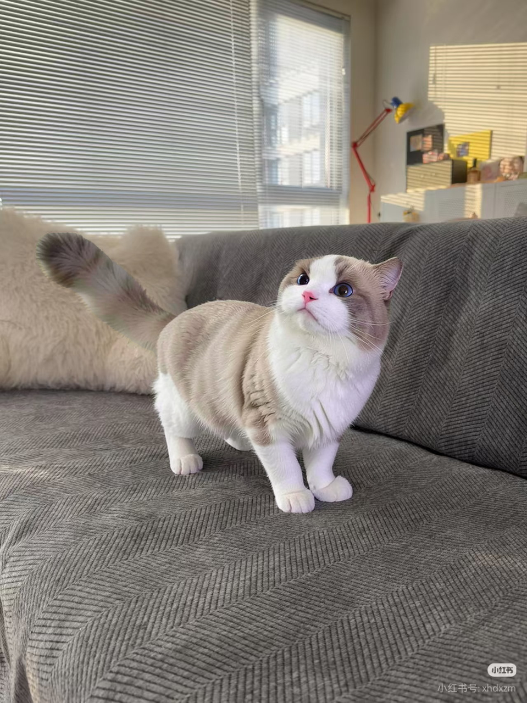
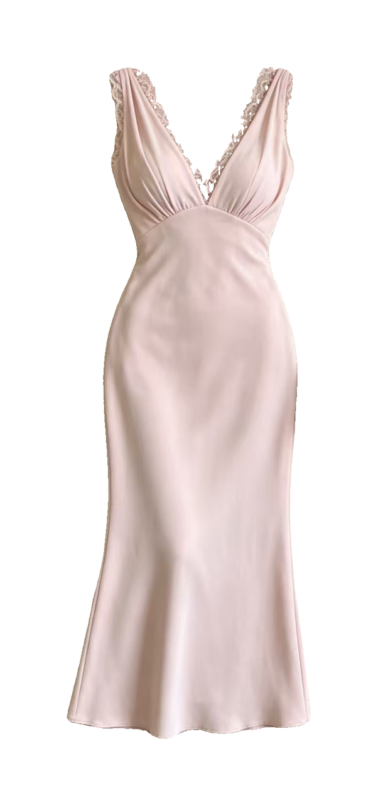

# FLUX Reference Compositor

基于参考图的局部对象替换工具。项目用一次 FLUX.2 Klein inpaint 完成生成，再通过 SAM 点选新旧主体，并在 CPU 上完成背景校色、边界融合和原分辨率合成。

## 效果示例

每组从左到右依次为 **原图 → Mask → 参考图 → 最终效果**。绿色覆盖区域表示指定的编辑区域。

### 主体替换

| 原图 | Mask | 参考图 | 最终效果 |
| :---: | :---: | :---: | :---: |
|  |  |  |  |

### 物品替换

| 原图 | Mask | 参考图 | 最终效果 |
| :---: | :---: | :---: | :---: |
|  |  |  |  |

### 服装替换

| 原图 | Mask | 参考图 | 最终效果 |
| :---: | :---: | :---: | :---: |
|  |  |  |  |

### 新增物体

| 原图 | Mask | 参考图 | 最终效果 |
| :---: | :---: | :---: | :---: |
|  |  |  |  |

## 核心特点

- Reference 主体可用 SAM1/SAM2 点选，也可直接使用已抠好的图片。
- Target 支持手绘编辑区或 SAM 自动分割。
- 新增物体与替换旧物体都只调用一次 FLUX。
- 生成后分别提取新主体和旧主体，避免矩形 ROI 或旧物体轮廓进入最终图。
- 背景校色阶段不加载第二个扩散模型或一致性 LoRA。
- 输出保持 Target 原始分辨率，并提供无损 PNG 下载。

## 工作流程

1. 上传 Reference，选择要迁移的主体。
2. 上传 Target，画出或分割允许编辑的区域。
3. 选择新增/替换模式并运行一次 FLUX。
4. 在生成 ROI 中点选新主体，在原图 ROI 中点选旧主体。
5. 执行背景校色与最终合成，下载原尺寸 PNG。

## 项目结构

```text
.
├── app.py                 # Gradio 界面与任务调度
├── flux_inpaint.py        # FLUX 推理和首次背景校色
├── image_processing.py    # Mask、色差校正与多频段合成
├── mask_editor.py         # 浏览器端手绘 Mask 编辑器
├── sam_segmenter.py       # SAM1/SAM2 点提示分割
├── object_segmenter.py    # 主体 Mask 调整与最终分层合成
├── ui_preview.py          # 预览图和原尺寸输出
├── tests/                 # CPU 回归测试
├── assets/examples/       # 原图、Mask、参考图与效果示例
└── requirements.txt
```

## 环境要求

- Python 3.10 或 3.11
- NVIDIA GPU 与匹配的 CUDA/PyTorch
- Gradio 3.39.x

先安装与你的 CUDA 版本匹配的 PyTorch，再安装项目依赖：

```bash
pip install torch torchvision --index-url https://download.pytorch.org/whl/cu128
pip install -r requirements.txt
pip install git+https://github.com/facebookresearch/sam2.git
```

## 模型路径

代码不包含个人机器的绝对路径。默认从项目下的 `models/` 读取模型，也可以通过环境变量覆盖：

```text
FLUX_MODEL_PATH=models/FLUX.2-klein-4B
FLUX_OUTPAINT_LORA_PATH=models/flux-2-klein-4B-outpaint-lora
SAM2_MODEL_PATH=models/sam2/sam2-hiera-large
SAM1_CHECKPOINT_PATH=models/sam/sam_vit_h_4b8939.pth
```

可复制 `.env.example` 作为本机配置参考。程序读取的是系统环境变量，不会自动加载 `.env`；模型路径也可以直接在界面的高级参数中修改。

## 启动

```bash
python app.py --server-name 0.0.0.0 --port 7860
```

然后访问 `http://服务器地址:7860`。
