# FLUX Reference Compositor

Reference-guided local image editing with a single FLUX.2 Klein inpainting pass. Use SAM to select subjects, then refine background colors and blend the result at the target image's original resolution.

## Examples

Each row shows the original image, editing mask, reference image, and final result. Green overlays indicate the selected editing regions. Click any preview to view the full-size image.

| Original | Mask | Reference | Result |
| :---: | :---: | :---: | :---: |
| <a href="assets/examples/cat/original.png">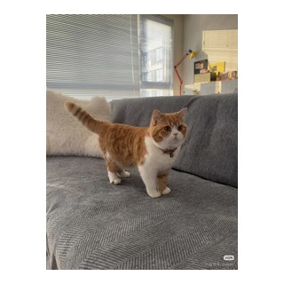</a> | <a href="assets/examples/cat/mask.png">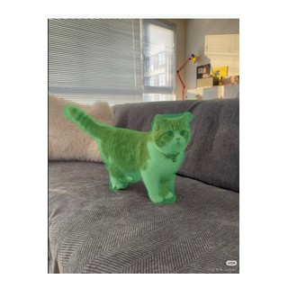</a> | <a href="assets/examples/cat/reference.png">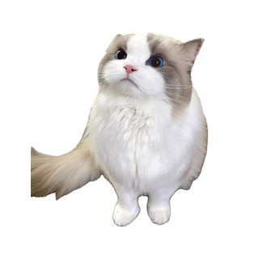</a> | <a href="assets/examples/cat/result.png">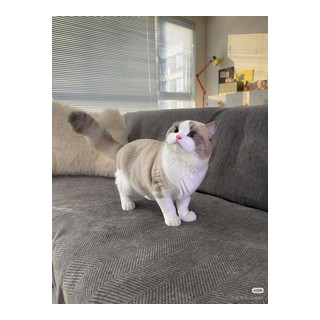</a> |
| <a href="assets/examples/coffee/original.png"></a> | <a href="assets/examples/coffee/mask.png"></a> | <a href="assets/examples/coffee/reference.png">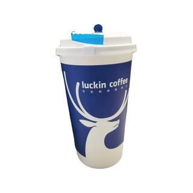</a> | <a href="assets/examples/coffee/result.png"></a> |
| <a href="assets/examples/dress/original.png">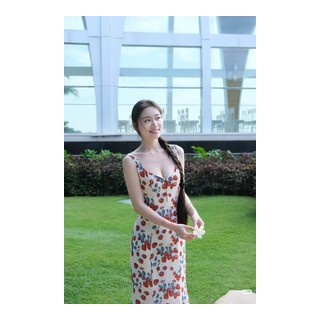</a> | <a href="assets/examples/dress/mask.png">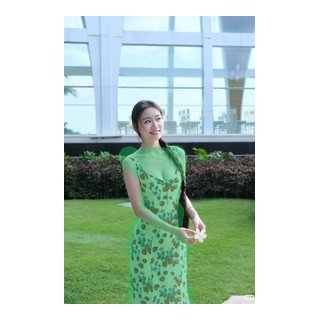</a> | <a href="assets/examples/dress/reference.png">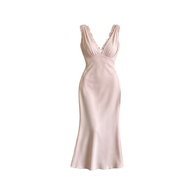</a> | <a href="assets/examples/dress/result.png">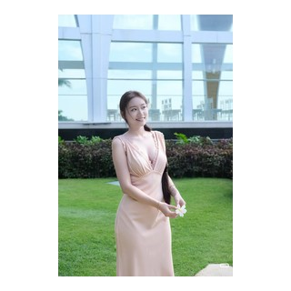</a> |
| <a href="assets/examples/bouquet/original.png">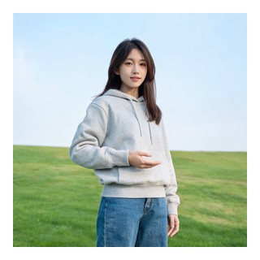</a> | <a href="assets/examples/bouquet/mask.png">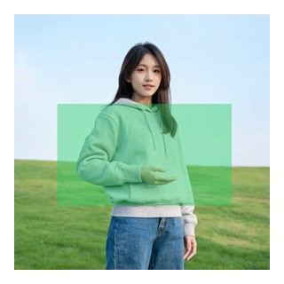</a> | <a href="assets/examples/bouquet/reference.png"></a> | <a href="assets/examples/bouquet/result.png">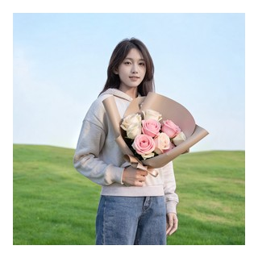</a> |

## Features

- Select reference subjects with SAM1/SAM2 point prompts or use a prepared cutout.
- Define target editing regions with the drawing editor or SAM segmentation.
- Insert or replace objects with a single FLUX generation pass.
- Refine generated and original subject masks through interactive SAM selection.
- Harmonize background colors on the CPU without a second diffusion pass.
- Export lossless PNG results at the target image's original resolution.

## Workflow

1. Upload a reference image and select the subject to transfer.
2. Upload a target image and draw or segment the editing region.
3. Choose the insertion or replacement mode and run FLUX.
4. Select the new subject in the generated region and the original subject in the target region.
5. Apply background color correction and final compositing, then download the full-resolution PNG.

## Project Structure

```text
.
├── app.py                 # Gradio interface and task scheduling
├── flux_inpaint.py        # FLUX inference and background color correction
├── image_processing.py    # Masks, color correction, and multiband blending
├── mask_editor.py         # Browser-based mask drawing editor
├── sam_segmenter.py       # SAM1/SAM2 point-prompt segmentation
├── object_segmenter.py    # Subject mask refinement and layered compositing
├── ui_preview.py          # Image previews and full-resolution output
├── tests/                 # CPU regression tests
├── assets/examples/       # Original images, masks, references, and results
└── requirements.txt
```

## Requirements

- Python 3.10 or 3.11
- An NVIDIA GPU with a compatible CUDA/PyTorch installation
- Gradio 3.39.x

Install PyTorch for your CUDA version, followed by the project dependencies. The command below uses the CUDA 12.8 wheel index:

```bash
pip install torch torchvision --index-url https://download.pytorch.org/whl/cu128
pip install -r requirements.txt
pip install git+https://github.com/facebookresearch/sam2.git
```

## Model Paths

Models are loaded from the project's `models/` directory by default. Override these locations with environment variables:

```text
FLUX_MODEL_PATH=models/FLUX.2-klein-4B
FLUX_OUTPAINT_LORA_PATH=models/flux-2-klein-4B-outpaint-lora
SAM2_MODEL_PATH=models/sam2/sam2-hiera-large
SAM1_CHECKPOINT_PATH=models/sam/sam_vit_h_4b8939.pth
```

See `.env.example` for the available settings. The application reads system environment variables; it does not load `.env` automatically. Model paths can also be changed in the interface's advanced settings.

## Launch

```bash
python app.py --server-name 0.0.0.0 --port 7860
```

Open `http://localhost:7860` in your browser, or replace `localhost` with your server's address.
